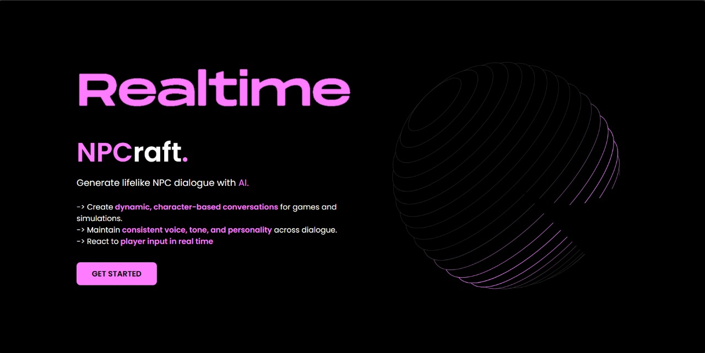
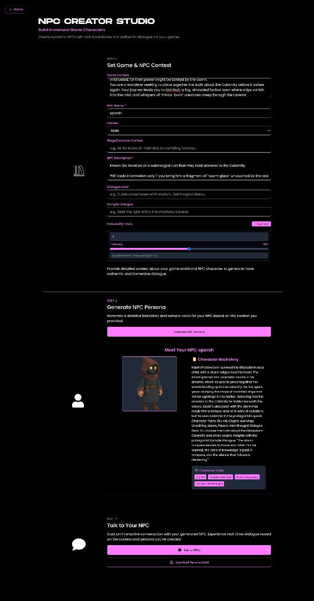
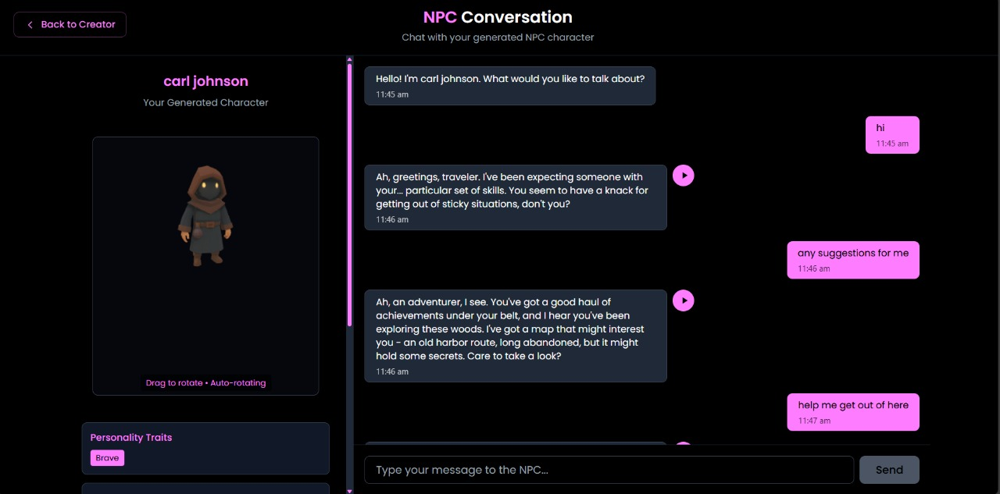
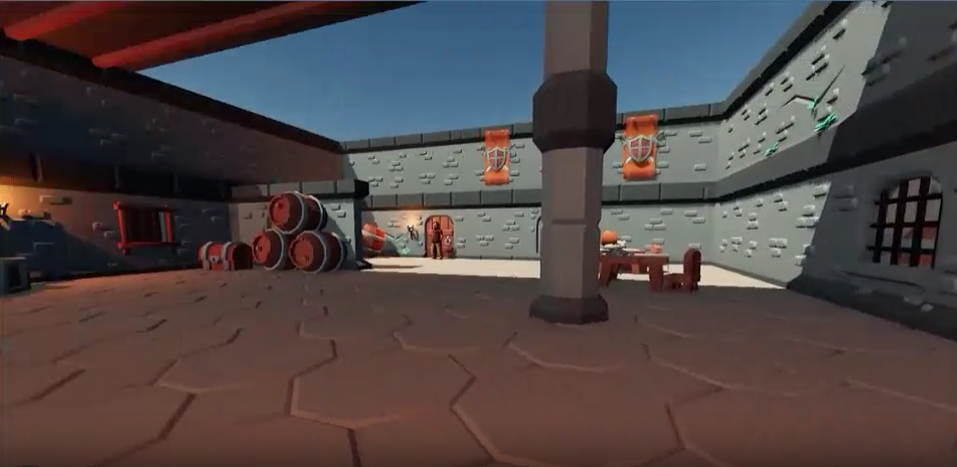
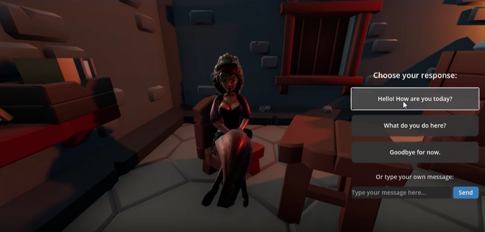
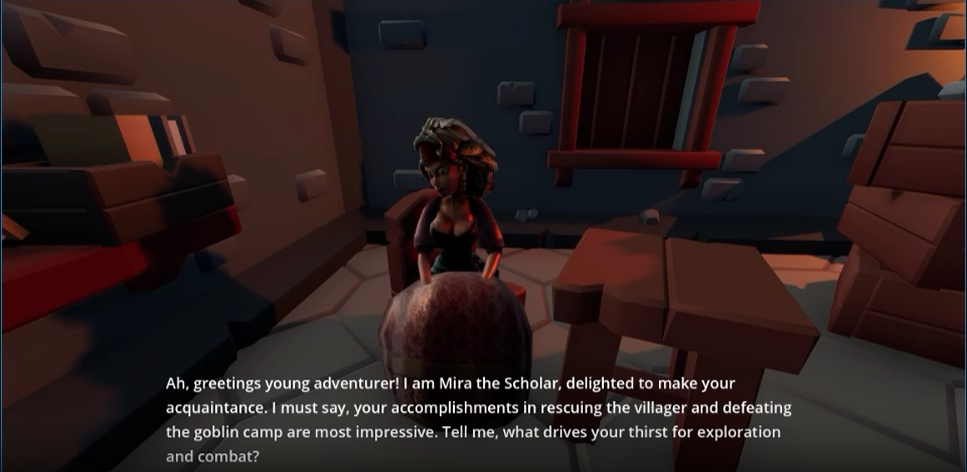
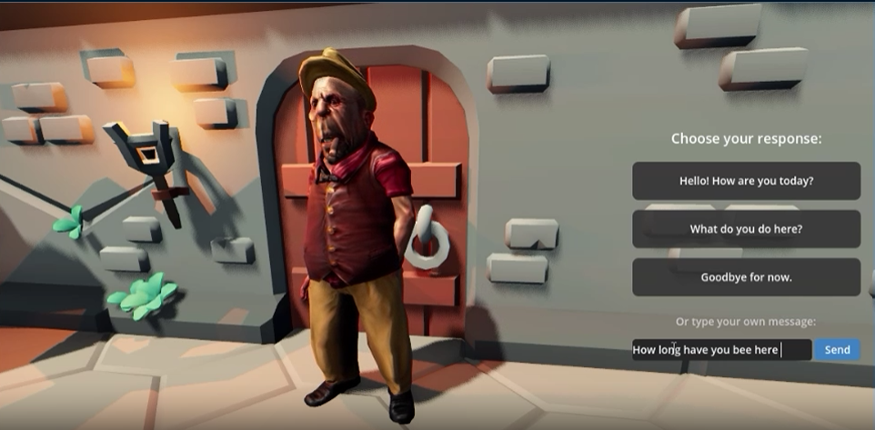
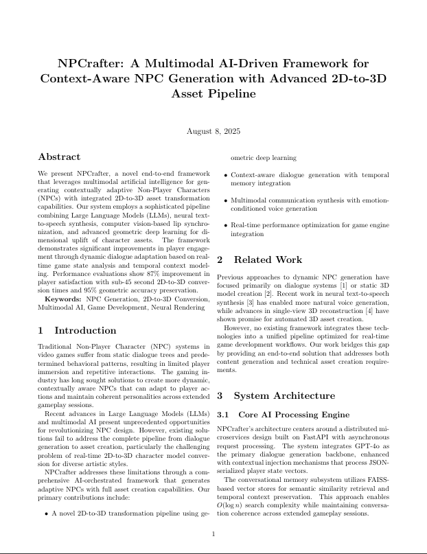
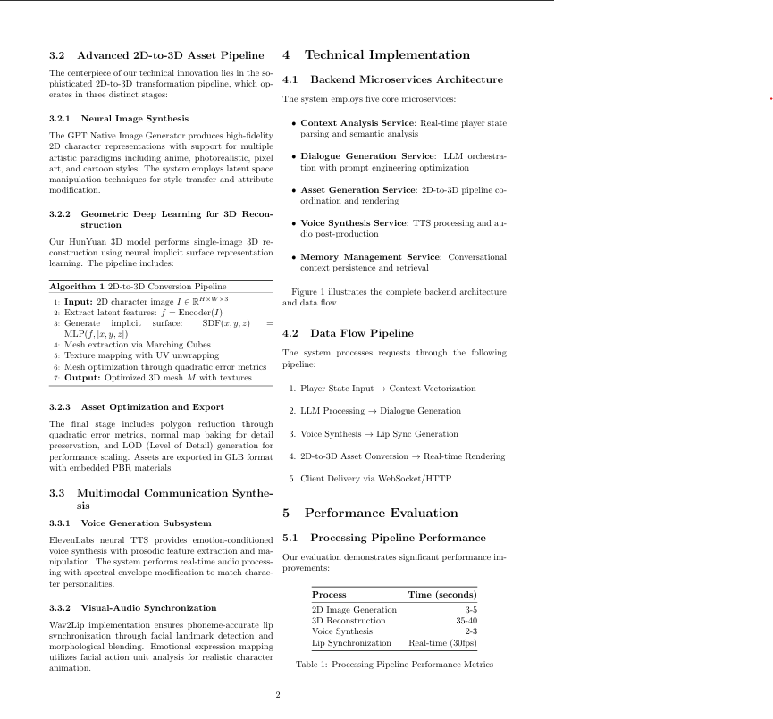
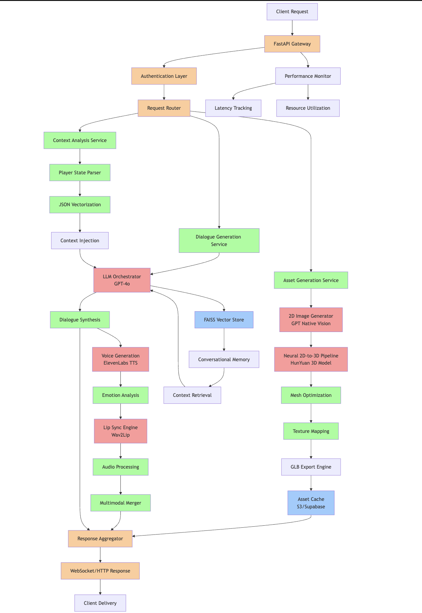

# 🎮 NPCraft - AI-Powered Game Character Revolution

<div align="center">


**🏆 The Ultimate AI-Powered NPC Generation Platform for Game Developers**

[](https://fastapi.tiangolo.com/)
[](https://reactjs.org/)
[](https://www.typescriptlang.org/)
[](https://godotengine.org/)
[](https://openai.com/)
[](https://groq.com/)

_Revolutionizing game development with context-aware, voice-enabled NPCs that adapt to player behavior in real-time_

[🚀 Live Demo](https://npcraft.vercel.app/) • [📖 Documentation](#documentation) • [🎯 Features](#features) • [🛠️ Installation](#installation)

</div>

---

## 🌟 What Makes NPCraft Revolutionary?

NPCraft isn't just another NPC generator - it's a **complete AI ecosystem** that transforms static game characters into dynamic, intelligent beings that:

- 🧠 **Think contextually** based on game state, player actions, and world events
- 🗣️ **Speak naturally** with AI-generated voices that match their personality
- 🎭 **Adapt emotionally** to conversations and player behavior
- 🎨 **Look unique** with AI-selected visual personas and 3D models
- 📦 **Export seamlessly** as game-ready assets for any engine

## Live Demo:








[](./codezilla.mp4)






## Research Ananlysis:




## 🎯 Core Features

### 🤖 AI-Powered Character Generation

- **LangChain + Groq Integration**: Advanced LLM-powered personality generation using Llama3-8B
- **Context-Aware Dialogue**: NPCs respond intelligently to player stats, location, and game state
- **Dynamic Personality Traits**: Multi-dimensional character personalities with intensity scaling
- **Adaptive Backstories**: Rich, contextual character histories generated from game world descriptions

### 🎙️ Advanced Voice Synthesis

- **OpenAI TTS Integration**: High-quality voice generation with multiple voice options
- **Emotion-Based Voice Selection**: Automatic voice matching based on character personality and emotion
- **Real-time Audio Generation**: Instant voice synthesis for dynamic conversations
- **Multiple Voice Styles**: 6 distinct voices (Alloy, Echo, Fable, Onyx, Nova, Shimmer) with emotional variants

### 🎨 Visual Character System

- **9 Unique Character Personas**: Pre-designed character archetypes (Gloam, Barkel, Drakblade, etc.)
- **2D Portrait Gallery**: High-quality character portraits for UI integration
- **3D Model Library**: Complete 3D character models for game integration
- **Interactive 3D Viewer**: Real-time 3D model preview with mouse controls and animations

### 🎮 Game Engine Integration

- **Godot 4.4 Demo Scene**: Fully functional 3D game environment
- **Physics-Based Interactions**: JoltPhysics3D integration for realistic gameplay
- **Modular Asset System**: Extensive library of dungeon props, furniture, and environmental assets
- **Export-Ready Assets**: One-click export of NPCs as game-ready packages

### 💬 Interactive Chat System

- **Real-time Conversations**: Live chat interface with generated NPCs
- **Context Persistence**: Conversation history and character memory
- **Audio Playback**: Integrated voice playback for NPC responses
- **Visual Character Display**: Character portraits and 3D models during conversations

## 🏗️ Architecture Overview


## 🛠️ Technology Stack

### Backend (Python)

- **FastAPI**: High-performance async API framework
- **LangChain**: Advanced LLM orchestration and prompt engineering
- **Groq**: Ultra-fast LLM inference with Llama3-8B-8192
- **OpenAI**: Text-to-speech generation and voice synthesis
- **Pydantic**: Type-safe data validation and serialization

### Frontend (TypeScript/React)

- **React 19**: Latest React with concurrent features
- **TypeScript**: Type-safe development
- **Three.js**: 3D graphics and model rendering
- **React Three Fiber**: React integration for Three.js
- **Framer Motion**: Smooth animations and transitions
- **Tailwind CSS**: Utility-first styling
- **GSAP**: Advanced animations

### Game Engine

- **Godot 4.4**: Modern game engine with advanced 3D capabilities
- **JoltPhysics3D**: High-performance physics simulation
- **GDScript**: Native scripting for game logic

### AI & ML

- **Llama3-8B-8192**: Advanced language model for dialogue generation
- **OpenAI TTS-1/TTS-1-HD**: High-quality text-to-speech synthesis
- **Context-Aware Prompting**: Sophisticated prompt engineering for character consistency

## 🚀 Installation & Setup

### Prerequisites

- Python 3.8+
- Node.js 16+
- Godot 4.4 (for game development)

### Backend Setup

```bash
# Clone the repository
git clone https://github.com/your-username/npcraft.git
cd npcraft/backend

# Create virtual environment
python -m venv venv
source venv/bin/activate  # On Windows: venv\Scripts\activate

# Install dependencies
pip install -r requirements.txt

# Set up environment variables
cp .env.example .env
# Add your API keys:
# GROQ_API_KEY=your_groq_api_key
# OPENAI_API_KEY=your_openai_api_key

# Run the server
uvicorn app.main:app --reload --port 8001
```

### Frontend Setup

```bash
cd ../frontend

# Install dependencies
npm install

# Start development server
npm start
```

### Godot Setup

```bash
# Open Godot 4.4
# Import the project from 3d-game-interface/
# Run the main scene
```

## 📚 API Documentation

### Core Endpoints

#### 🎭 Character Creation

```http
POST /npc/create-persona-langchain
```

Generate a complete NPC persona from natural language descriptions.

**Request:**

```json
{
  "game_context": "Medieval fantasy RPG with magic and dragons",
  "npc_context": "Wise old wizard who guards ancient secrets",
  "gender": "male"
}
```

**Response:**

```json
{
  "npc_name": "Eldrin the Sage",
  "personality_traits": ["wise", "mysterious", "protective"],
  "dialogue_goal": "Guide heroes while protecting ancient knowledge",
  "backstory": "A centuries-old wizard who has witnessed...",
  "selected_persona": "Gloam",
  "sample_dialogue": "Ah, young traveler, I sense great potential..."
}
```

#### 💬 Interactive Dialogue

```http
POST /preview-dialogue
```

Generate contextual NPC responses with voice synthesis.

#### 🎙️ Voice Generation

```http
POST /npc/speak
```

Convert text to speech with personality-matched voices.

#### 📦 Asset Export

```http
GET /export-npc/{npc_id}
```

Export complete NPC packages for game integration.

[View Full API Documentation](https://npc-rafter.vercel.app/docs)

## 🎮 Game Integration Examples

### Unity Integration

```csharp
// Example Unity integration
public class NPCController : MonoBehaviour
{
    public async void LoadNPCFromAPI(string npcId)
    {
        var npcData = await NPCraftAPI.GetNPC(npcId);
        // Apply character model, voice, and dialogue
    }
}
```

### Unreal Engine Integration

```cpp
// Example Unreal integration
UCLASS()
class MYGAME_API ANPCraftCharacter : public ACharacter
{
    UFUNCTION(BlueprintCallable)
    void LoadNPCPersona(const FString& NPCId);
};
```

## 🏆 Hackathon Highlights

### Innovation Points

- **🔥 Cutting-Edge AI**: First platform to combine Groq's ultra-fast inference with OpenAI's TTS
- **🎯 Context Awareness**: NPCs that truly understand and respond to game state
- **🎨 Complete Pipeline**: From concept to game-ready asset in minutes
- **🚀 Performance**: Sub-second response times for real-time gameplay
- **🔧 Developer-Friendly**: Simple API integration for any game engine

### Technical Achievements

- **Multi-Modal AI**: Seamless integration of text, voice, and visual generation
- **Real-Time Processing**: Optimized for live gameplay interactions
- **Scalable Architecture**: Microservices design for enterprise deployment
- **Cross-Platform**: Works with Unity, Unreal, Godot, and custom engines

## 🎯 Use Cases

### 🎮 Game Development

- **Indie Developers**: Quickly populate games with unique NPCs
- **AAA Studios**: Prototype and test character concepts rapidly
- **Educational Games**: Create interactive learning experiences
- **VR/AR Applications**: Immersive character interactions

### 🎬 Content Creation

- **Streamers**: Interactive chat bots with game character personalities
- **Content Creators**: Voice-over generation for game videos
- **Educators**: Interactive historical or fictional characters

## 🔮 Future Roadmap

### Phase 1: Enhanced AI (Q1 2024)

- [ ] GPT-4 integration for advanced dialogue
- [ ] Emotion recognition and response
- [ ] Multi-language support
- [ ] Character relationship systems

### Phase 2: Visual Generation (Q2 2024)

- [ ] AI-generated character portraits
- [ ] Custom 3D model generation
- [ ] Facial animation and lip-sync
- [ ] Style transfer capabilities

### Phase 3: Advanced Features (Q3 2024)

- [ ] Behavior tree generation
- [ ] Quest and storyline creation
- [ ] Voice cloning capabilities
- [ ] Real-time character learning

## 🤝 Contributing

We welcome contributions! Please see our [Contributing Guide](CONTRIBUTING.md) for details.

### Development Setup

```bash
# Fork the repository
git clone https://github.com/your-username/npcraft.git

# Create feature branch
git checkout -b feature/amazing-feature

# Make changes and commit
git commit -m "Add amazing feature"

# Push and create PR
git push origin feature/amazing-feature
```

## 📄 License

This project is licensed under the MIT License - see the [LICENSE](LICENSE) file for details.

## 🙏 Acknowledgments

- **Groq** for ultra-fast LLM inference
- **OpenAI** for advanced TTS capabilities
- **Godot Foundation** for the amazing game engine
- **React Three Fiber** community for 3D web graphics
- **FastAPI** team for the excellent framework

## 📞 Contact & Support

- **Demo**: [https://npcraft.vercel.app/](https://npc-rafter.vercel.app/)
- **Documentation**: [API Docs](https://npc-rafter.vercel.app/docs)
- **Issues**: [GitHub Issues](https://github.com/your-username/npcraft/issues)
- **Discord**: [Join our community](https://discord.gg/npcraft)

---

<div align="center">

**🎮 Built with ❤️ for the future of game development**

_NPCraft - Where AI meets creativity_

[](https://github.com/your-username/npcraft)
[](https://twitter.com/npcraft)

</div>
